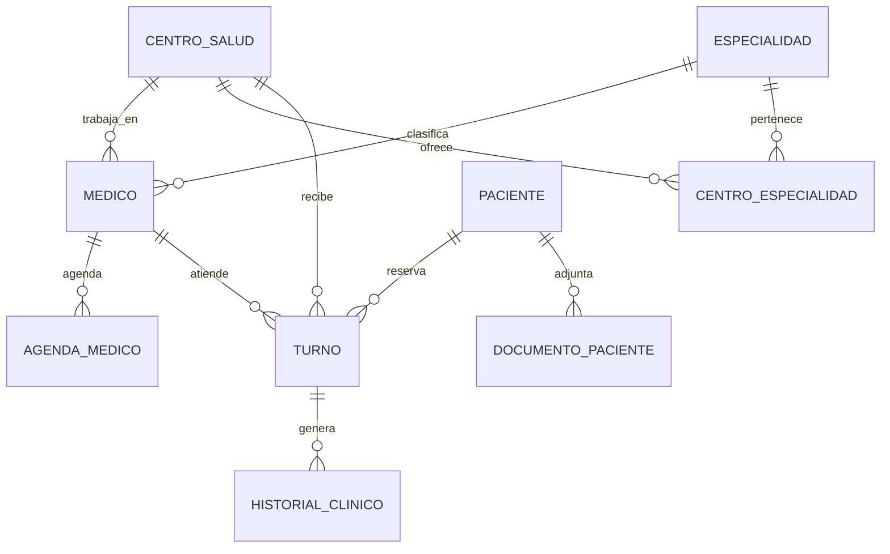

# Salud Chilecito - Oracle + Python DAO

Plataforma de gestion de turnos y datos clinicos para Chilecito, Nonogasta,
Sanogasta y Vichigasta. Esta version adapta la idea original a una entrega de
Base de Datos II con Oracle XE, scripts SQL, roles, tablespaces, capa DAO en
Python, pruebas automatizadas y una interfaz web funcional para operar la
plataforma desde el navegador.

## Que problema resuelve

En Chilecito muchas personas todavia deben trasladarse y hacer fila temprano
para averiguar si hay turnos. El sistema propuesto centraliza centros de salud,
medicos, especialidades, pacientes, agendas y turnos para que cada institucion
pueda operar digitalmente y el ciudadano tenga informacion clara antes de ir.

## Alcance de la entrega

- Oracle XE en Docker para levantar un entorno reproducible.
- Tablespaces separados para datos e indices.
- Roles de administracion y consulta con usuarios de aplicacion.
- Esquema relacional para centros, especialidades, medicos, pacientes, agendas,
  turnos, historial clinico y documentos.
- Indices sobre claves foraneas y campos de busqueda.
- Seed SQL con datos locales de Chilecito.
- DAO Python con operaciones CRUD y consultas utiles.
- Interfaz grafica web para centros, pacientes, turnos y documentos.
- API local con almacenamiento JSON de demo para usar la plataforma aunque
  Oracle todavia no este inicializado.
- Scripts de instalacion y uso para Windows y Ubuntu.
- Tests de contrato para validar estructura SQL y DAOs sin depender de una base
  activa.

## Tecnologias

| Tecnologia | Uso |
|---|---|
| Oracle Database XE 21c | Base de datos principal |
| Docker Compose | Contenedor local reproducible |
| Python 3.12 | Capa DAO, seed y demo |
| python-oracledb | Driver oficial Oracle para Python |
| HTML/CSS/JavaScript | Interfaz web en navegador |
| pytest | Pruebas automatizadas |

## Estructura

```text
plataforma-salud-chilecito/
|-- docker-compose.yml
|-- requirements.txt
|-- .env.example
|-- dbscripts.sql
|-- sql/
|   |-- 01_tablespaces.sql
|   |-- 02_users_roles.sql
|   |-- 03_schema.sql
|   |-- 04_indexes.sql
|   |-- 05_seed.sql
|   |-- 06_validate.sql
|   `-- 07_security_checks.sql
|-- src/
|   |-- config/
|   |-- dao/
|   |-- models/
|   |-- webapp/
|   |-- services/
|   `-- main.py
|-- data/
|   `-- demo_seed.json
|-- tests/
|-- docs/
`-- scripts/
```

## Instalacion rapida

1. Clonar el repositorio.

```bash
git clone https://github.com/davidfajardotorres777/plataforma-salud-chilecito.git
cd plataforma-salud-chilecito
```

2. Crear variables de entorno.

```bash
cp .env.example .env
```

3. Levantar Oracle.

```bash
docker compose up -d
docker logs -f oracle_salud_chilecito
```

4. Crear entorno Python e instalar dependencias.

```bash
python -m venv .venv
.venv\Scripts\activate
pip install -r requirements.txt
```

5. Ejecutar los scripts SQL en orden con SQL Developer o SQL*Plus. Los scripts
   `01` y `02` se ejecutan con usuario administrador; el resto con el esquema
   `salud`.

```sql
@sql/01_tablespaces.sql
@sql/02_users_roles.sql
@sql/03_schema.sql
@sql/04_indexes.sql
@sql/05_seed.sql
@sql/06_validate.sql
```

6. Ejecutar demo y tests.

```bash
python -m src.main
pytest -q
```

7. Ejecutar la plataforma grafica en navegador.

Windows:

```powershell
scripts\windows\02_iniciar_plataforma.ps1
```

Ubuntu:

```bash
bash scripts/ubuntu/02_iniciar_plataforma.sh
```

Luego abrir:

```text
http://localhost:8000
```

La interfaz permite crear pacientes, reservar turnos, cambiar estados, consultar
centros/medicos y adjuntar documentos de pacientes. Si Oracle no esta listo,
trabaja con `runtime/salud_chilecito_data.json` para que el profesor pueda usar
la demo completa desde Chrome, Edge o Firefox.

## Scripts de instalacion

| Sistema | Script | Uso |
|---|---|---|
| Windows | `scripts/windows/01_instalar.ps1` | Instala Git, Python, Docker y dependencias Python |
| Windows | `scripts/windows/02_iniciar_plataforma.ps1` | Levanta Oracle, abre navegador e inicia la web |
| Windows | `scripts/windows/03_cargar_oracle.ps1` | Ejecuta scripts SQL con SQL*Plus |
| Ubuntu | `scripts/ubuntu/01_instalar.sh` | Instala Git, Python, Docker y dependencias |
| Ubuntu | `scripts/ubuntu/02_iniciar_plataforma.sh` | Levanta Oracle e inicia la web |
| Ubuntu | `scripts/ubuntu/03_cargar_oracle.sh` | Ejecuta scripts SQL con SQL*Plus |

Guia completa de uso: [docs/USO_PLATAFORMA.md](docs/USO_PLATAFORMA.md).

## Modelo de datos



## Roles

| Rol | Permisos |
|---|---|
| `rl_salud_admin` | CRUD sobre tablas del sistema |
| `rl_salud_consulta` | Lectura para reportes y auditoria |

Usuarios incluidos:

- `salud`: esquema propietario.
- `salud_app_admin`: usuario de aplicacion con rol admin.
- `salud_consulta_01`, `salud_consulta_02`, `salud_consulta_03`: usuarios de
  consulta con password life time de 15 dias.

## Comparacion con las referencias

El repositorio sigue la linea del profesor `hdrobins/dao`: SQL principal,
conexion Python, DAOs y pruebas. Tambien toma de los repos de companeros la
documentacion de instalacion, seed y scripts de verificacion, pero aplicado a
tu idea de Salud Chilecito y a una entrega Oracle.

## Autores

Alesandro David Fajardo
---Kevin Facundo nuñez
Ingenieria en Sistemas - Universidad Nacional de Chilecito
Base de Datos II - 2026
