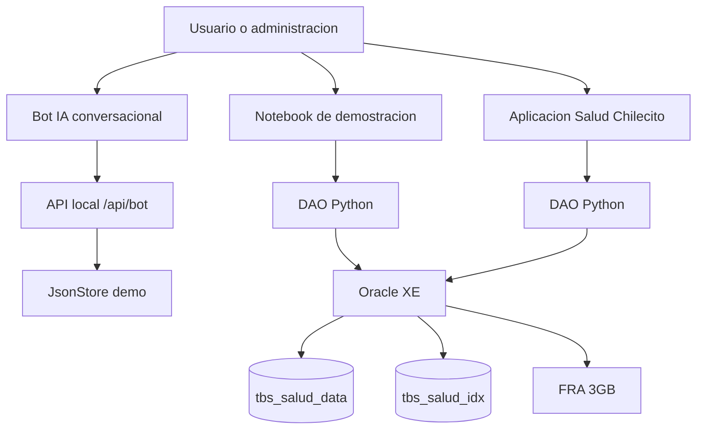

# Arquitectura de Salud Chilecito

## Componentes

## Decisiones principales

- Oracle es la base principal de la entrega de Base de Datos II.
- La plataforma grafica y el bot IA son dos entradas separadas del mismo
  proyecto web local.
- El bot IA usa reglas locales y el mismo `JsonStore` de la demo para operar sin
  claves externas ni internet.
- Los datos transaccionales viven en tablas normalizadas.
- Los documentos clinicos pueden guardarse como BLOB o por URL externa.
- Los indices se separan en `tbs_salud_idx` para cumplir el criterio fisico.
- El esquema propietario es `salud`; los usuarios de aplicacion reciben roles.

## Migracion desde la idea NoSQL

| Idea original | Modelo Oracle |
|---|---|
| Coleccion de centros | Tabla `centro_salud` |
| Coleccion de medicos | Tabla `medico` |
| Documento paciente | Tabla `paciente` |
| Agenda embebida por medico | Tabla `agenda_medico` |
| Turnos con referencias extendidas | Tabla `turno` con FK a paciente, medico y centro |
| Adjuntos externos | Tabla `documento_paciente` con BLOB o URL |
